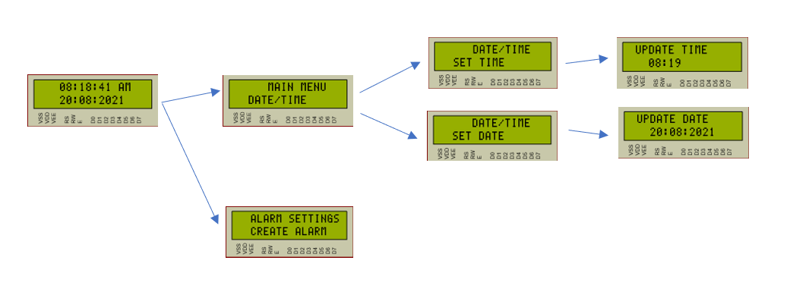
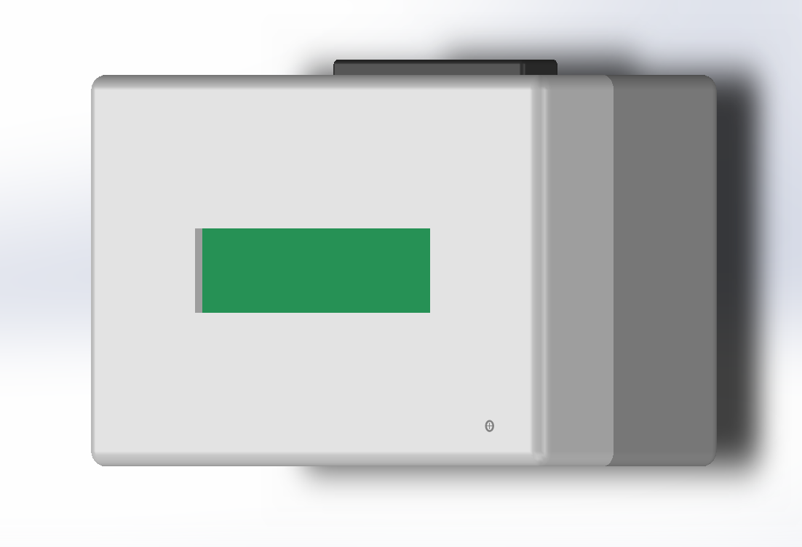
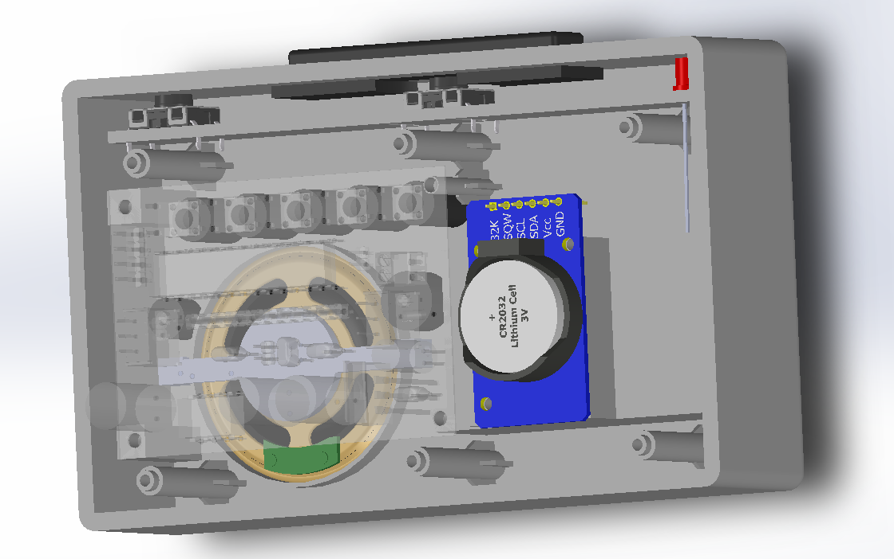

# [REAL-TIME-CLOCK](https://github.com/sanjith1999/Laboratory-Practice1-Real-Time-Clock/blob/master/Report/main.pdf)
 
Time is so precious and waking up at the desired time will help to make it through a busy day easily. Therefore, an alarm clock is a necessary item for anyone nowadays. We have developed a simple alarm clock that displays user modifiable time and have the ability
to manage up to six alarms in real-time, using ATmega328p as the brain and some other inexpensive electronic components. Beyond the simple design, We experimented with PCB designing, various aspects of enclosure
design and other aesthetic aspects which would stand behind our product to make it commercially successful.

### FLOW DIAGRAM

### FLOW DIAGRAM : DISPLAY

### LAYOUT DESIGNS

### ENCLOSURE DESIGNS

&nbsp;
&nbsp;
&nbsp;
The complete report on the design process can be found [here](https://github.com/sanjith1999/Laboratory-Practice1-Real-Time-Clock/blob/master/Report/main.pdf)
